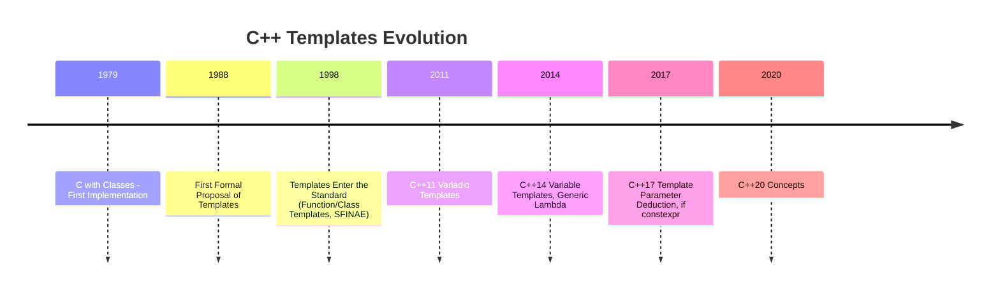

### Preface: The Evolution of C++ Templates
The evolution of templates is a highly significant milestone in the history of C++ development. Personally, I believe that Concepts represent the most impactful feature along this trajectory. Before diving into the details of Concepts, let us first review the development of templates over time.



<!--more-->     

According to Mr. Stroustrup's recollection, the concept of templates dates back to 1982. However, it was officially proposed at the 1988 USENIX C++ Conference.
The initial motivation for designing templates stemmed from the lack of a standard library in C++ at the time. Without templates, it was difficult to design "vector" and "list" containers that could work with multiple data types.

By 1998, templates were officially included in the C++ standard. Even before that, C++ templates had already evolved into a Turing-complete language. Theoretically, any computable problem could be solved using template code alone, utilizing techniques like recursion for loops, template specialization, and partial specialization for branching logic.

For instance, the following template demonstrates a Fibonacci function that can be computed at compile-time:

```cpp
template<int  N>
int fibonacci() {
  return fibonacci<N-1>() + fibonacci<N-2>(); 
}
template<>
int fibonacci<1>() { return 1; }
template<>
int fibonacci<0>() { return 0; }
```

The **SFINAE** feature ensures the proper functioning of the above code.
The two template specializations establish the base case for recursion, implicitly implementing the functionality of an if condition.

By the time C++17 introduced `if constexpr`, the same code could be written in a much more "straightforward" manner.

```cpp
template<int N>
constexpr int fibonacci(){
  if constexpr(N <= 1)
    return N;
  else
    return fibonacci<N-1>() + fibonacci<N-2>();
}
auto val = fibonacci<5>();
```

Whether it's **SFINAE**, `std::enable_if`, or `if constexpr`, they all essentially serve the same purpose: making the use of compile-time if more straightforward and user-friendly. Compile-time if can be used to evaluate numeric conditions, as seen in the Fibonacci template example, but more often, it is used to evaluate types—a task for which `std::enable_if` is specifically designed.

```cpp
template <typename T, std::enable_if_t<std::is_enum<T>::value, bool> = true>
void func(const T& value) {
  // When T is an enum type, this template function is selected
  .......
}
template <typename T, std::enable_if_t<std::is_arithmetic<T>::value, bool> = true>
void func(const T& value) {
  // When `T` is a numeric type, this template function is selected
  .......
}
```

`func` has an overload, and its internal logic needs to differentiate between `value`'s type: handling enum and numeric types separately. 
To allow the compiler to match the correct function template during instantiation, we use `std::enable_if_t` with this long piece of code. While it accomplishes the functionality, the code is verbose and lacks readability.  

At this point, **concepts** can come into play.

### 1. What is a Concept?
— A constraint (or a set of constraints) on `T`.  

Let’s demonstrate "constraints on `T`" with a simple example: 

```cpp
template<typename T>
concept Integral = std::is_integral<T>::value;

template<Integral T> 
bool equal(const T& a, const T& b){
    return a == b;
}
``` 
The function template `equal` returns whether two values are equal. This operation cannot be applied to floating-point types.  
To prevent this template from being instantiated with `float` or other floating-point types, an `Integral` concept is used to constrain `T`—ensuring that the template can only be instantiated with integer types.  

In the function template `equal`, `T` is no longer just a "typename"; it is now constrained by `Integral`, which is semantically more precise.  
If we attempt to instantiate it with a floating-point type, an error will be raised:  

```cpp
auto value_a = equal(1, 3);       //OK
auto value_b = equal(0.11, 0.33); //ERROR
```

`equal(0.11, 0.33)` will result in a compile-time error:

### 2. Why Do We Need Concepts?
If we use `std::enable_if` to implement the functionality above, we can compare it to **concepts** in terms of two aspects: code readability and error messages.  

**1. Better Code Readability**
Concepts provide a much clearer and more intuitive way to express constraints, making the code easier to understand and maintain.
```cpp
template<typename T, std::enable_if_t<std::is_integral<T>::value, bool> = true>
bool equal_2(const T& a, const T& b){
    return a == b;
}
```
Using concepts to constrain `T` is more concise and aligns better with natural semantics compared to `std::enable_if`.  

**2. Reduced Code Duplication**  
Using `std::enable_if` for type constraints can lead to a lot of repetitive code, whereas concepts are much easier to reuse.  


**3. Clearer and More Direct Error Messages**  
When a concept is not satisfied, the compiler directly points out which concept is not met. On the other hand, error messages from `std::enable_if` feel more like "scratching an itch through the boot."  


**4. Four Syntax Forms for Constraining `T`**
```cpp
template<my_concept T>
void func(T t);

void func(my_concept t);

template<typename T> requires my_concept<T>
void func(T t);

template<typename T> 
void func(T t) requires my_concept<T>;
```

The second form is undoubtedly the most concise and naturally semantic way to write it.  

The last two forms use the `requires` keyword, a method known as a "require-clause," which allows for the convenient combination of multiple concepts:  

```cpp
template<typename T> requires concept_a<T> && concept_b<T> || sizeof<T> == 4
void func(T t);
```

**4. Built-in Concepts**  
The `<concepts>` header file provides commonly used concepts that satisfy most daily development needs.  

These concepts can be categorized into:  
- Core language concepts  
- Comparison concepts  
- Object concepts  
- Callable concepts  
- Iterator concepts  
- Range concepts  

**Concept**

| Concept               | Description in |
|-----------------------|-------------------------------|
| `same_as`          | A type that is identical to another type.                      |
| `derived_from`      | A type derived from another type.                              |
| `convertible_to`    | A type that can be explicitly or implicitly converted to another type. |
| `common_reference_with` | Two types that share a common reference type.              |
| `common_with`       | Two types that share a common type after type promotion.       |
| `integral`          | A type that is an integer type.                                |
| `signed_integral`   | A type that is a signed integer type.                          |
| `unsigned_integral` | A type that is an unsigned integer type.                       |
| `floating_point`    | A type that is a floating-point type.                          |
| `assignable_from`   | A type that can be assigned a value from another type.         |
| `swappable`         | A type whose instances can be swapped, or two types that can be swapped with each other. |
| `swappable_with`    | Two types that can be swapped with each other.                 |
| `destructible`      | A type whose objects can be properly destroyed.                |
| `constructible_from`| A type whose variables can be constructed from a set of argument types, or explicitly initialized with argument types.|
| `default_constructible` | A type whose objects can be default-constructed.           |
| `move_constructible` | A type whose objects can be move-constructed.                 |
| `copy_constructible` | A type whose objects can be copy-constructed and move-constructed. |
| `boolean`               | A type that can be used in boolean logic.                       |
| `equality_comparable`   | A type where the `==` operator defines an equality relationship.      |
| `equality_comparable_with` | A type that can define equality relationships with another type.   |
| `totally_ordered`       | A type where comparison operators define a total order.               |
| `totally_ordered_with`  | A type that can define a total order relationship with another type.  |
| `movable`               | A type whose objects can be moved and swapped.                        |
| `copyable`              | A type whose objects can be copied (`copyable`) and moved (`movable`).|
| `semiregular`           | A type that is `copyable` and supports default initialization.        |
| `regular`               | A type that is semiregular and also equality comparable (`equality_comparable`).|
| `invocable`             | A callable type that can be invoked with a given set of argument types. |
| `regular_invocable`     | A callable type that adheres to the rules of regular invocation.        |
| `predicate`             | A callable type that evaluates to a boolean value.                    |
| `relation`              | A callable type that evaluates to a binary relationship.              |
| `strict_weak_order`     | A binary relationship that imposes a strict weak ordering.            |
| `readable`              | A type that can be read using the dereference operator `*`.                                           |
| `writable`              | A type whose referenced object can be written to via an iterator.                                    |
| `weakly_incrementable`  | A `semiregular` type that supports prefix and postfix increment operations.                           |
| `incrementable`         | A `weakly_incrementable` type where increment operations preserve equality comparability.             |
| `input_or_output_iterator` | A type whose object can be incremented and dereferenced.                                           |
| `sentinel_for`          | A type that acts as a positional indicator for an `input_or_output_iterator`.                         |
| `sized_sentinel_for`    | A type that acts as a sentinel for an iterator, supporting difference calculations with constant time.|
| `input_iterator`        | A type for reading values via an input iterator, supporting prefix/postfix increment operations.      |
| `output_iterator`       | A type for writing values via an output iterator, supporting prefix/postfix increment operations.     |
| `forward_iterator`      | A type that extends `input_iterator` with equality comparison and multi-pass traversal.               |
| `bidirectional_iterator`| A `forward_iterator` that supports backward traversal.                                               |
| `random_access_iterator`| A `bidirectional_iterator` supporting constant-time random access for forward and backward traversal. |
| `contiguous_iterator`   | A `random_access_iterator` that points to elements stored contiguously in memory.                    |
| `range`                 | Specifies a type as a range, providing `begin` and `end` iterators.                                   |
| `safe_range`            | Specifies a `range` type that safely returns iterators without undefined behavior.                    |
| `sized_range`           | Specifies a range where the size can be determined in constant time.                                  |
| `view`                  | Specifies a range that supports constant-time copy, move, and assignment.                             |
| `input_range`           | Specifies a range whose iterator satisfies `input_iterator`.                                          |
| `output_range`          | Specifies a range whose iterator satisfies `output_iterator`.                                         |
| `forward_range`         | Specifies a range whose iterator satisfies `forward_iterator`.                                        |
| `bidirectional_range`   | Specifies a range whose iterator satisfies `bidirectional_iterator`.                                  |
| `random_access_range`   | Specifies a range whose iterator satisfies `random_access_iterator`.                                  |
| `contiguous_range`      | Specifies a range whose iterator satisfies `contiguous_iterator`.                                     |
| `common_range`          | Specifies a range with compatible iterators and sentinels.                                            |
| `viewable_range`        | Specifies a `range` that can be safely converted to a `view`.                                         |

**5. Defining Your Own Concepts**  
If the concepts provided in the `<concepts>` header file cannot satisfy specific requirements, we need to define our own concepts:  

```cpp
template <template-parameter-list >
concept concept-name = constraint-expression;
```

It is worth noting that the definition of a concept cannot be recursive and cannot be constrained by other concepts during its definition.

```cpp
template<typename T>
concept V = V<T*>; // Error: Recursive definition is not allowed
 
template<C1 T>
concept Error1 = true; // Error: Cannot be constrained by other concepts

template<class T> requires C1<T>
concept Error2 = true; // Error: Cannot be constrained by other concepts
```
If the `template-parameter-list` of a concept declares more than one parameter, the argument list provided when using the concept must have one fewer argument than the parameter list.  
```cpp
template <typename T, typename B>
concept Derived = std::is_base_of<B, T>::value;
template<Derived<Base> T>
void f(T param);
```

**6. The `requires` Keyword**  
In Section 3, we introduced the `requires` keyword, which can be used to define a "require-clause" to enforce constraints. A require-clause can combine multiple constraints using `&&` and `||` operators for flexibility.  

In addition to require-clauses, the `requires` keyword has another usage: the **require-expression**.  

```cpp
requires {requirement-seq}
requires (parameter-list) {requirement-seq}
```

```cpp
template<typename T> 
concept C = requires(T x, T y) {
  //////////////////////////Simple Constraints////////////////////////////
  x+y;            // x+y is valid (x and y can be added) 
  T::func();      // T defines a static method func (public)
  x.func2();      // T defines a non-static method func2 (public)
  &x;             // x can be addressed 
  sizeof(T) == 10;// sizeof(T) can be compared with 10 — this constraint is always true
   
  //////////////////////////Type Constraints////////////////////////////
  typename T::MyType; // MyType is a nested type defined within T (public)
  
  //////////////////////////Composite Constraints////////////////////////////
  //1. x.func() is valid (func is a member method of x)
  //2. MyType is defined within T
  //3. The return value of func() can be converted to MyType
  {x.func()} -> std::convertible_to<typename T::MyType>; 
  // x.func() is valid and does not throw exceptions
  {x.func()} noexcept;      
  {*x};
  
  //////////////////////////Nested Constraints////////////////////////////
  requires MyConcept<T>;    // T satisfies the constraints of the MyConcept concept
  requires (sizeof(T) == 4);// T's objects occupy 4 bytes of memory                             
};
```

Using a `requires-expression` allows the definition of concepts with very complex logic.
The parentheses `()` enclose the parameter list (which is optional), while the curly braces `{}` enclose the constraint list.  

The expressions in the constraint list are checked by the compiler for validity (the expressions are not evaluated; only their feasibility is verified), and the result is `true` or `false`. If all expressions in the constraint list pass the checks, the `requires` expression evaluates to `true`.  

In this example, the constraint `x + y;` does not actually perform addition but instead requires that `x` and `y` are "addable."

The constraints in a constraint list can be divided into four categories:

1. **Simple Constraints**: An arbitrary expression, where the compiler only checks its syntactical validity. For example: `x + y;` is a simple constraint.
2. **Type Constraints**: Starts with `typename`, followed by a type name.  
3. **Composite Constraints**: Has the form `{ expression } noexcept (optional) -> return-type-requirement (optional);`.The compiler checks the validity of `expression`. If `noexcept` is used, the compiler also checks whether `expression` may potentially throw exceptions. Finally, if `return-type-requirement` is not omitted, the compiler checks whether the return type of `expression` matches the requirement.  
4. **Nested Constraints**: Starts with the `requires` keyword, followed by other constraint expressions.  

### Afterword  

When researching `concept`, the term `constraints` often appears alongside it. These two terms can be confusing. Personally, I think they can be understood as follows:

1. `Concept` is a means, while `constraints` are the goal. `Concept` is the tool used to achieve constraints.
2. The essence of a `concept` is a set. This set defines one or more "conditions." During compilation, these "conditions" are applied to `T`. If `T` fails to satisfy any of these "conditions," a compilation error is generated. This process is what constraints are about.
3. The relationship between `concept` and templates is akin to the relationship between templates and regular code. Templates generalize specific types into `T`, while concepts impose constraints on `T`.  
