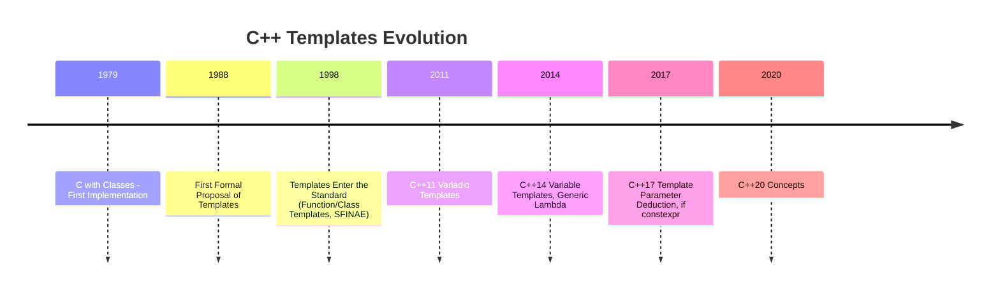

前言：C++模板的演进
模板的演进是C++发展史中一条十分重要的线，个人觉得Concept是这条线中最大的一个特性了。在介绍Concept之前，我们先捋一捋模板这条线的发展。



<!--more-->

据Stroustrup先生回忆， 对模板的设想早在1982年便有了，正式提出是在1998年的 USENIX C++ conference会议上提出，设计模板的初衷是因为当时的C++缺少一个标准库，而当时没有模板的C++很难设计出“vector、list”这种适用于多种类型的容器。
到1998年模板正式进入标准，在这之前C++模板已经是一个图灵完备的语言了——理论上来讲，可以只用模板代码解决任何可计算的问题。用递归实现循环、模板特化、偏特化实现分支判断。例如下面这个模板可以在编译期计算的fibonacci函数：
```cpp
template<int  N>
int fibonacci() {
  return fibonacci<N-1>() + fibonacci<N-2>(); 
}
template<>
int fibonacci<1>() { return 1; }
template<>
int fibonacci<0>() { return 0; }
```
**SFINAE**特性为上述代码的运作提供了保障。两个模板的特化构造了递归的退出条件，“隐式”的实现了if判断的功能。到了C++17，有了if constexpr，上面这段代码可以写的更加“直白”
```cpp
template<int N>
constexpr int fibonacci(){
  if constexpr(N <= 1)
    return N;
  else
    return fibonacci<N-1>() + fibonacci<N-2>();
}
auto val = fibonacci<5>();
```
不管是**SFINAE**、`std::enable_if`、还是`if constexpr`，其实都在做一件事：使编译期if的使用更加直白易用。编译期if可以用来判断数值，如fibonacci模板，更多的时候是用来判断“类型”，`std::enable_if`便是如此。
```cpp
template <typename T, std::enable_if_t<std::is_enum<T>::value, bool> = true>
void func(const T& value) {
  //当T是枚举类型时，匹配当前模板函数
  .......
}
template <typename T, std::enable_if_t<std::is_arithmetic<T>::value, bool> = true>
void func(const T& value) {
  //当T是数值类型时，匹配当前模板函数
  .......
}
```
func有一个重载，func的内部逻辑需要区分value的类型：enum跟数值类型分开处理。为了使编译器能够在实例化时匹配到正确的函数模板，我们用std::enable_if_t这一长串的代码，功能实现了，但代码十分冗长、可读性不好。
此时concept可以登场了。

1，什么是concept
——对T的约束(的集合)
通过一个简单的例子来展示“对T的约束”
```cpp
template<typename T>
concept Integral = std::is_integral<T>::value;

template<Integral T> 
bool equal(const T& a, const T& b){
    return a == b;
}
```
函数模板equal返回两个值是否相等，这个操作不能用在浮点类型中。为防止该模板被float等浮点类型实例化，使用一个Integral concept来约束T——也就是强制保证该模板只能使用整数类型实例化。
函数模板equal的T不再是一个“typename”，变成了“Integral”，显然语义上Integral更精准。当我们试图用浮点类型实例化时，会给出错误：
```cpp
auto value_a = equal(1, 3);       //OK
auto value_b = equal(0.11, 0.33); //ERROR
```
equal(0.11, 0.33) 会在编译时报错：


2，我们为什么需要concept
假如使用std::enable_if来实现上述功能，可以从代码可读性以及报错信息两个方面来感受concept的便捷：
1，更好的代码可读性
```cpp
template<typename T, std::enable_if_t<std::is_integral<T>::value, bool> = true>
bool equal_2(const T& a, const T& b){
    return a == b;
}
```
使用concept约束T，比使用`enable_if`更加简洁、符合自然语义。
2，减少重复代码
使用`std::enable_if`进行类型约束容易出现大量的重复代码，而concept则很容易重复利用。
3，更清晰、更直接的报错信息
concept不满足时编译器会直接告知哪个concept未满足，`enable_if`实现方式的报错更像是“隔靴搔痒”

3，约束T的四种语法形式
```cpp
template<my_concept T>
void func(T t);

void func(my_concept t);

template<typename T> requires my_concept<T>
void func(T t);

template<typename T> 
void func(T t) requires my_concept<T>;
```
第二种无疑是最简洁、最符合自然语义的写法了。后两种使用了requires关键字，这种方式称为“require-clause”（require子句），可以方便的组合多个concept:
```cpp
template<typename T> requires concept_a<T> && concept_b<T> || sizeof<T> == 4
void func(T t);
```
4，内置concept
`<concepts>`头文件内置了常用的concept，可以满足大多数日常开发需求：
这些concept可分语言核心concept、为比较concept、对象concept、调用concept、迭代器concept、范围concept

**Concepts**

| Concept               | Description in |
|-----------------------|-------------------------------|
| `same_as`          | A type that is identical to another type.                      |
| `derived_from`      | A type derived from another type.                              |
| `convertible_to`    | A type that can be explicitly or implicitly converted to another type. |
| `common_reference_with` | Two types that share a common reference type.              |
| `common_with`       | Two types that share a common type after type promotion.       |
| `integral`          | A type that is an integer type.                                |
| `signed_integral`   | A type that is a signed integer type.                          |
| `unsigned_integral` | A type that is an unsigned integer type.                       |
| `floating_point`    | A type that is a floating-point type.                          |
| `assignable_from`   | A type that can be assigned a value from another type.         |
| `swappable`         | A type whose instances can be swapped, or two types that can be swapped with each other. |
| `swappable_with`    | Two types that can be swapped with each other.                 |
| `destructible`      | A type whose objects can be properly destroyed.                |
| `constructible_from`| A type whose variables can be constructed from a set of argument types, or explicitly initialized with argument types.|
| `default_constructible` | A type whose objects can be default-constructed.           |
| `move_constructible` | A type whose objects can be move-constructed.                 |
| `copy_constructible` | A type whose objects can be copy-constructed and move-constructed. |
| `boolean`               | A type that can be used in boolean logic.                       |
| `equality_comparable`   | A type where the `==` operator defines an equality relationship.      |
| `equality_comparable_with` | A type that can define equality relationships with another type.   |
| `totally_ordered`       | A type where comparison operators define a total order.               |
| `totally_ordered_with`  | A type that can define a total order relationship with another type.  |
| `movable`               | A type whose objects can be moved and swapped.                        |
| `copyable`              | A type whose objects can be copied (`copyable`) and moved (`movable`).|
| `semiregular`           | A type that is `copyable` and supports default initialization.        |
| `regular`               | A type that is semiregular and also equality comparable (`equality_comparable`).|
| `invocable`             | A callable type that can be invoked with a given set of argument types. |
| `regular_invocable`     | A callable type that adheres to the rules of regular invocation.        |
| `predicate`             | A callable type that evaluates to a boolean value.                    |
| `relation`              | A callable type that evaluates to a binary relationship.              |
| `strict_weak_order`     | A binary relationship that imposes a strict weak ordering.            |
| `readable`              | A type that can be read using the dereference operator `*`.                                           |
| `writable`              | A type whose referenced object can be written to via an iterator.                                    |
| `weakly_incrementable`  | A `semiregular` type that supports prefix and postfix increment operations.                           |
| `incrementable`         | A `weakly_incrementable` type where increment operations preserve equality comparability.             |
| `input_or_output_iterator` | A type whose object can be incremented and dereferenced.                                           |
| `sentinel_for`          | A type that acts as a positional indicator for an `input_or_output_iterator`.                         |
| `sized_sentinel_for`    | A type that acts as a sentinel for an iterator, supporting difference calculations with constant time.|
| `input_iterator`        | A type for reading values via an input iterator, supporting prefix/postfix increment operations.      |
| `output_iterator`       | A type for writing values via an output iterator, supporting prefix/postfix increment operations.     |
| `forward_iterator`      | A type that extends `input_iterator` with equality comparison and multi-pass traversal.               |
| `bidirectional_iterator`| A `forward_iterator` that supports backward traversal.                                               |
| `random_access_iterator`| A `bidirectional_iterator` supporting constant-time random access for forward and backward traversal. |
| `contiguous_iterator`   | A `random_access_iterator` that points to elements stored contiguously in memory.                    |
| `range`                 | Specifies a type as a range, providing `begin` and `end` iterators.                                   |
| `safe_range`            | Specifies a `range` type that safely returns iterators without undefined behavior.                    |
| `sized_range`           | Specifies a range where the size can be determined in constant time.                                  |
| `view`                  | Specifies a range that supports constant-time copy, move, and assignment.                             |
| `input_range`           | Specifies a range whose iterator satisfies `input_iterator`.                                          |
| `output_range`          | Specifies a range whose iterator satisfies `output_iterator`.                                         |
| `forward_range`         | Specifies a range whose iterator satisfies `forward_iterator`.                                        |
| `bidirectional_range`   | Specifies a range whose iterator satisfies `bidirectional_iterator`.                                  |
| `random_access_range`   | Specifies a range whose iterator satisfies `random_access_iterator`.                                  |
| `contiguous_range`      | Specifies a range whose iterator satisfies `contiguous_iterator`.                                     |
| `common_range`          | Specifies a range with compatible iterators and sentinels.                                            |
| `viewable_range`        | Specifies a `range` that can be safely converted to a `view`.                                         |


5，定义自己的concept
假如遇到了`<concepts>`头文件内的concept无法满足实际需求的 场景，我们就需要定义自己的concept：
```cpp
template <template-parameter-list >
concept concept-name = constraint-expression;
```
值得注意的是，concept的定义，不能递归、不能在定义时被其他concept约束
```cpp
template<typename T>
concept V = V<T*>; // Error: 不能递归定义
 
template<C1 T>
concept Error1 = true; // Error: 不能被其他concept约束

template<class T> requires C1<T>
concept Error2 = true; // Error: 不能被其他concept约束
```
若concept的template-parameter-list声明的形参大于一个，则使用concept时实参列表需比形参列表少1：
```cpp
template <typename T, typename B>
concept Derived = std::is_base_of<B, T>::value;
template<Derived<Base> T>
void f(T param);
```
6，requires关键字
我们在第3节中已经介绍过requires关键字，它可以引出一个“require-clause”（require子句）来实现约束，require子句可以配合 && 、||  操作符灵活组合多个约束。
除了require-clause之外，requires关键字还有另外一种用法，那就是require-expression：
```cpp
requires {requirement-seq}
requires (parameter-list) {requirement-seq}
```
```cpp

template<typename T> 
concept C = requires(T x, T y) {
  //////////////////////////简单约束////////////////////////////
  x+y;            // x+y有意义(x与y可以相加) 
  T::func();      // T类型定义了静态方法func(public)
  x.func2();      // T类型定义了非静态方法func2(public)
  &x;             // x可以取地址 
  sizeof(T) == 10;// sizeof(T)可以与10比较——该约束永远为成立 
   
  //////////////////////////类型约束////////////////////////////
  typename T::MyType; //  MyType是T内定义的一个内置类型(public) 
  
  //////////////////////////复合约束////////////////////////////
  //1, x.func() 合法(func是x的成员方法)
  //2, MyType在T内有定义
  //3, func()的返回值可以转换为MyType
  {x.func()} -> std::convertible_to<typename T::MyType>; 
  //x.func() 合法且不会抛出异常
  {x.func()} noexcept;      
  {*x};
  
  //////////////////////////嵌套约束////////////////////////////
  requires MyConcept<T>;    //T满足MyConcept概念的约束
  requires (sizeof(T) == 4);//T的对象占用4字节内存                             
};
```
使用requires-expression可以定义逻辑非常复杂的concept，()内是参数列表——是可省略的，{}内是约束列表。约束列表中的表达式会在编译器检查其合法性（并不是求表达式的值，只是做一个可行性检查），结果是true或者false。若约束列表中的表达式都能通过，则本条requires表达式的值为true。在本例中，x+y; 约束并不会真的相加求值，而是要求x与y是“可相加的”。
约束列表中的约束可以分为四类：
1. **简单约束**：一个随意的表达式，编译器只检查其语法合法性。x+y; 便是一个简单约束。
2. **类型约束**:  以typename开头，后跟随一个类型名。
3. **复合约束**: 形如{ expression } noexcept(可略) -> return-type-requirement(可略) ;编译器会检查expression的合法性，假如noexcept有被使用，编译器还会检查expression有无潜在的抛出异常的可能，最后，假如return-type-requirement没被省略，则检查exp
4. **嵌套约束**: 以requires关键字开头，后跟其他约束表达式


### 后语：
在查阅资料时与concept一起出现的还有constraints一词，该词意为“约束”，这两个名词经常让人迷糊，个人觉得可以这样理解：
1. concept是手段，是实现约束的手段，constraints——约束才是目的。
2. concept的本质是一个集合——该集合内定义了一个或多个“条件”，编译期将这些“条件”实施到T上，若T不满足这些“条件”中的任何一个则给出编译错误，这个过程便是约束。
3. concept之于模板的意义，恰似模板之于普通代码的意义。后者将某个具体类型泛化成T，前者则给T以约束。